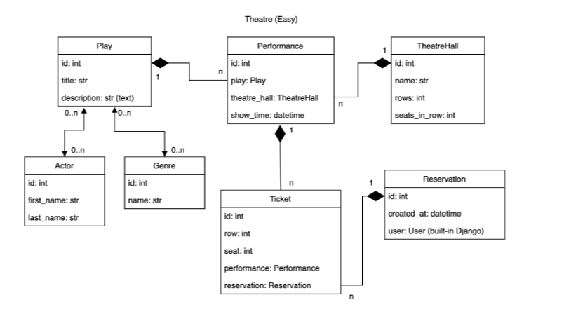

# Theatre api service

Theatre api service is a web application that allows users to order a tickets to the theatre plays

## DB Structure 


# Log in using:
    
      admin: admin
      password: 1234

or create your own user using python manage.py createsuperuser
## Installation

1. Clone the repository:

   ```shell
   git clone https://github.com/KirillMelanich/radio_station.git
   
2. Navigate to the project directory and activate virtual environment:
   ```shell
   cd radio-station
   python3 - venv venv
   venv/Scripts/activate(on Windows)
   source venv/bin/activate(on Mac)
   
3. Install dependencies:
   ```shell
    pip install -r requirements.txt
   
4. Perform database migrations:
    ```shell
    python manage.py migrate

5. Add these apps to `INSTALLED_APPS` and install their latest version.

      ```python
        INSTALLED APPS = [
                    ...,
        "drf_spectacular",
        "rest_framework",
   ]
   ```

## Usage

1. Run the development server:
     ```shell
    python manage.py runserver
2. Open your web browser and visit:
    ```shell 
    http://localhost:8000/

3. Enjoy your purchase!
